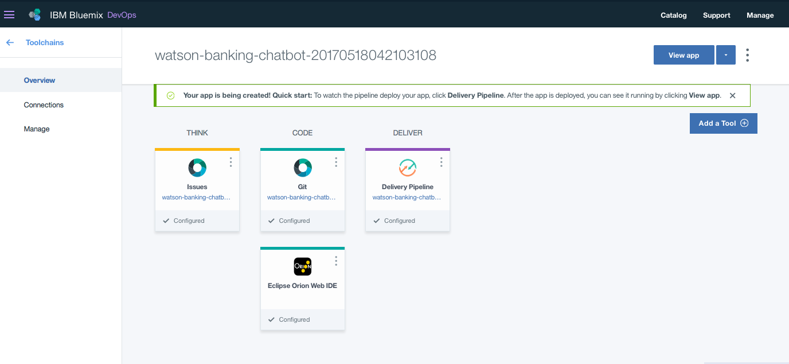

# Steps

Use the ``Deploy to IBM Cloud`` button **OR** create the services and run locally.

## Deploy to IBM Cloud

1. Press the above ``Deploy to IBM Cloud`` button and then click on ``Deploy``.

2. In Toolchains, click on ``Delivery Pipeline`` to watch while the app is deployed. Once deployed, the app can be viewed by clicking ``View app.

